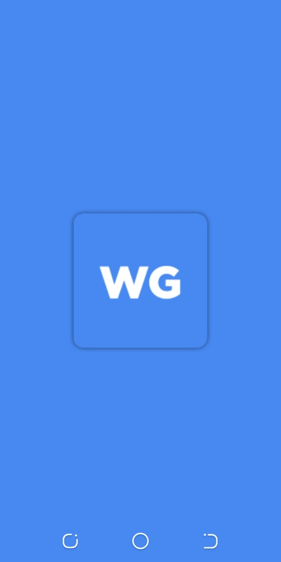
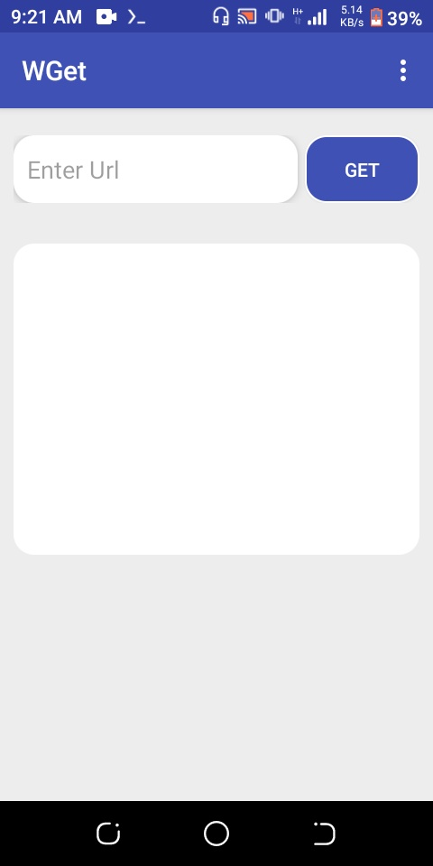
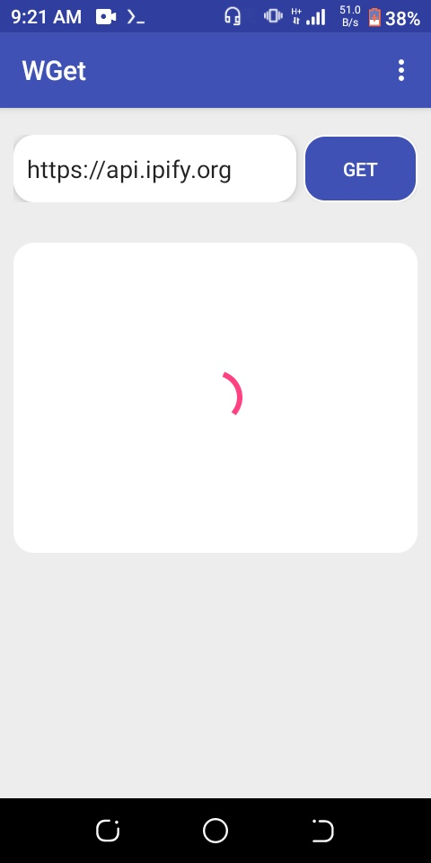
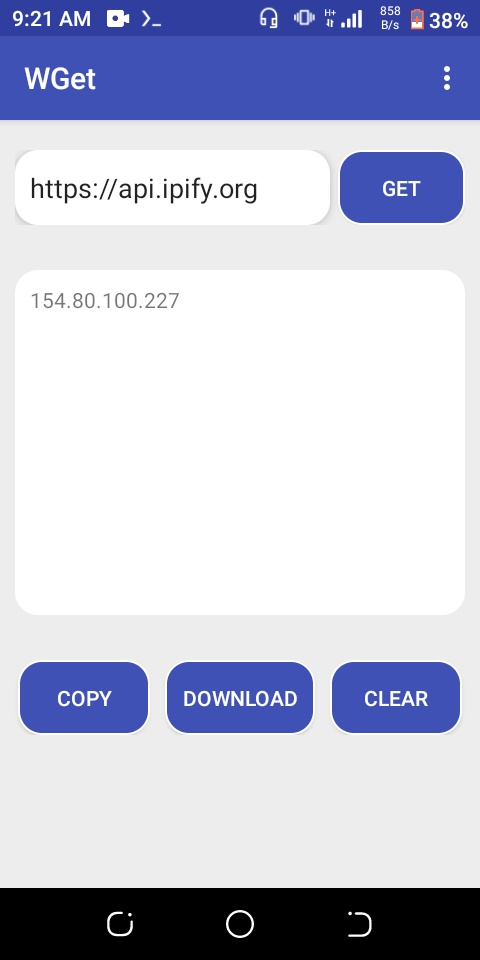
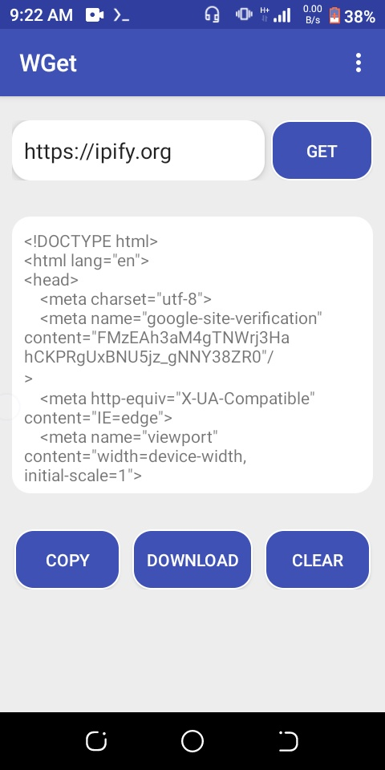

<div align="center">

# WGet

A clean, native Android utility for fetching HTTP/HTTPS web content and managing file downloads.

[](LICENSE)
[](https://developer.android.com)
[](https://developer.android.com)
[](https://www.oracle.com/java/)

</div>

## Overview

WGet provides a graphical interface on Android to retrieve source code, inspect HTTP responses, and trigger downloads using the Android DownloadManager service.

This is a legacy project originally developed on a mobile device using AIDE (Android IDE), which has now been updated and synchronized with modern Android Studio and Gradle build tools.

## Features

- Fetch raw HTTP/HTTPS responses from any valid URL.
- Inspect headers and web page markup directly on device.
- Copy fetched responses to clipboard with a single click.
- Download target files directly to device storage.
- Crash reporting and error log diagnostics.

## Screenshots

<p align="center">
  
  
  
</p>
<p align="center">
  
  
  
</p>

## Requirements

- Android 5.0 (API Level 21) or higher
- JDK 17 or higher for building from source

## Building from Source

Clone the repository and build using the Gradle wrapper:

```bash
git clone https://github.com/farhaanaliii/WGet.git
cd WGet
./gradlew assembleDebug
```

The compiled APK will be generated under `app/build/outputs/apk/debug/`.

## Author

Farhan Ali
- GitHub: [@farhaanaliii](https://github.com/farhaanaliii)
- Email: i.farhanali.dev@gmail.com

## License

This project is licensed under the MIT License - see the [LICENSE](LICENSE) file for details.